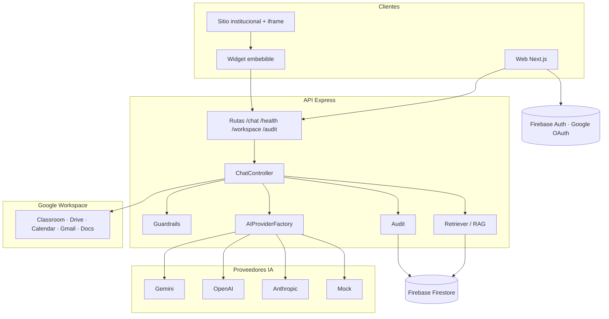

# Diagrama de Componentes

```mermaid
graph TB
  subgraph Clientes
    WEB[Web Next.js]
    WID[Widget embebible]
    SITE[Sitio institucional + iframe]
  end

  subgraph API[API Express]
    R[Rutas /chat /health /workspace /audit]
    CTRL[ChatController]
    GR[Guardrails]
    RAG[Retriever / RAG]
    AUD[Audit]
    AIF[AIProviderFactory]
  end

  subgraph Proveedores IA
    G[Gemini]
    O[OpenAI]
    A[Anthropic]
    M[Mock]
  end

  subgraph Google[Google Workspace]
    WS[Classroom · Drive · Calendar · Gmail · Docs]
  end

  DB[(Firebase Firestore)]
  AUTH[(Firebase Auth · Google OAuth)]

  WEB --> R
  WID --> R
  SITE --> WID
  R --> CTRL
  CTRL --> GR
  CTRL --> RAG
  CTRL --> AIF
  CTRL --> AUD
  AIF --> G & O & A & M
  RAG --> DB
  AUD --> DB
  CTRL --> WS
  WEB --> AUTH
```

El `ChatController` depende de **interfaces** (AIProvider, retriever, workspace),
no de implementaciones concretas → se cambian sin tocar la orquestación.
