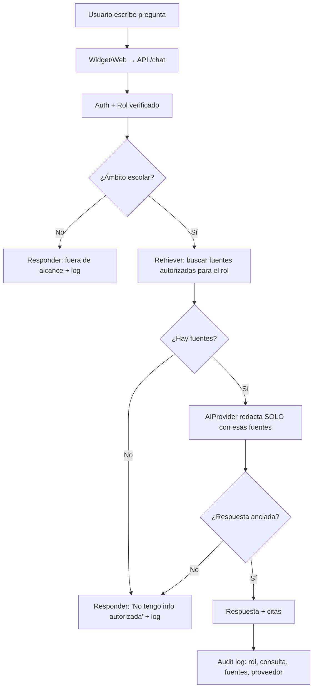

# Diagrama de Flujo · Consulta con grounding


```mermaid
flowchart TD
  U[Usuario escribe pregunta] --> A[Widget/Web → API /chat]
  A --> B[Auth + Rol verificado]
  B --> C{¿Ámbito escolar?}
  C -->|No| X[Responder: fuera de alcance + log]
  C -->|Sí| D[Retriever: buscar fuentes autorizadas para el rol]
  D --> E{¿Hay fuentes?}
  E -->|No| Y[Responder: 'No tengo info autorizada' + log]
  E -->|Sí| F[AIProvider redacta SOLO con esas fuentes]
  F --> G{¿Respuesta anclada?}
  G -->|No| Y
  G -->|Sí| H[Respuesta + citas]
  H --> Z[Audit log: rol, consulta, fuentes, proveedor]
```

Las decisiones C, E y G son los **guardrails** que garantizan que ASE-IA nunca
inventa. Son independientes del proveedor de IA.
```
